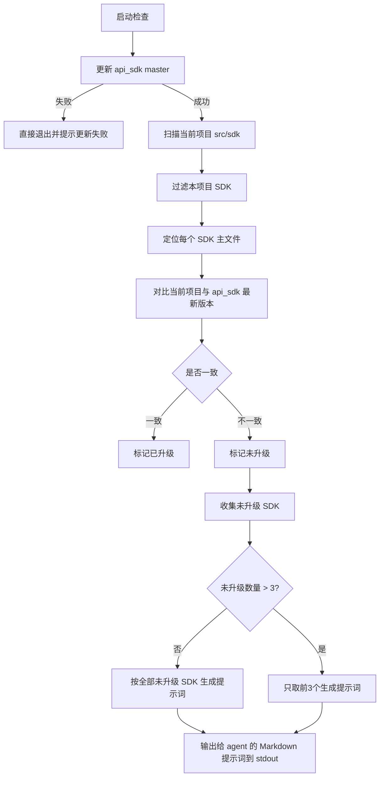

# PRD (开发规范引用)
请在阅读本脚本具体功能前，务必先查看并遵守 `PRD_COMMON.md` 中的“通用开发规范”。

# 脚本具体 PRD: external-SDK-Upgrade-Checker

## 1. 产品概述

### 1.1 产品定位
这是一个给 Python 项目维护者和 AI agent 使用的 `CLI` 检查工具，用来判断当前项目 `src/sdk` 下的**本项目 SDK 之外的 SDK**是否已经和 `/home/coder/github/kevinanew/api_sdk/python` 中的最新 SDK 对齐。

工具只做检查和输出，不直接修改代码。

### 1.2 核心目标
- 自动找出当前项目里需要检查的 SDK
- 拉取最新的 `api_sdk` 版本作为对照
- 通过主文件对比判断 SDK 是否已升级
- 生成给 AI agent 使用的 Markdown 提示词
- 为未升级的 SDK 生成可直接交给 AI agent 的升级提示词
- 兼容 `check.py` 的判定方式：子脚本是否通过只看退出码，`0` 代表通过，`1` 代表失败

### 1.3 产品形态
- **形态**：Python CLI 脚本
- **输出**：仅输出给 AI agent 的 Markdown 提示词
- **用途**：本地执行、CI 执行、AI agent 读取

### 1.4 使用方法
```bash
python code_doctor/外部SDK升级检查器.py <项目名>
```

- `<项目名>` 可选
- 如果不指定项目名，脚本默认在当前命令执行目录下进行检查
- 如果指定项目名，脚本应以该项目名作为识别和检查的基准

---

## 2. 目标用户与使用场景

### 2.1 用户画像
- Python 项目维护者
- 平台 / 基建工程师
- AI agent 执行者

### 2.2 典型场景
- 开发者在合并前检查当前项目 `src/sdk` 里的 SDK 是否落后
- CI 在定时任务中扫描 SDK 升级状态
- AI agent 读取提示词后，批量更新未升级 SDK

---

## 3. 核心用户动线



### 异常分支
- `api_sdk` 更新失败
- 当前项目 SDK 找不到主文件
- 对应最新 SDK 不存在
- 文件读取失败或比较失败

---

## 4. 功能清单

```text
Python SDK Upgrade Checker Harness
├── 🔴 更新参考仓库 master
├── 🔴 扫描当前项目 src/sdk
├── 🔴 固定识别并排除本项目 SDK
├── 🔴 主文件定位与回退
├── 🔴 主文件差异比对
├── 🔴 SDK 文件补齐
├── 🔴 未升级 SDK 数量统计
├── 🔴 最多 3 个 SDK 的 AI 提示词生成
└── 🔴 仅输出 agent 提示词到 stdout
```

---

## 5. 规则定义

- **本项目 SDK**：项目名与 sdk 名系统一致的那个 SDK，直接固定识别，不参与升级检查。
- **非本项目 SDK**：当前项目 `src/sdk` 下除本项目 SDK 之外的其他 SDK。
- **最新版本来源**：`/home/coder/github/kevinanew/api_sdk/python`
- **参考仓库更新规则**：检查前必须先更新 `api_sdk` 的 `master` 分支，且必须按以下顺序执行：
  1. `cd /home/coder/github/kevinanew/api_sdk`
  2. `git fetch origin`
  3. `git checkout master`
  4. `git reset --hard origin/master`
  如果更新失败，直接退出并提示“更新失败，请重试”。
- **主文件规则**：优先使用 `目录名同名 .py`，找不到则回退到 `__init__.py`。
- **升级判定规则**：当前项目主文件与最新 SDK 主文件无差异，则判定为“已升级”。
- **处理上限**：一次脚本运行最多只处理 3 个未升级 SDK；超过 3 个时，仅选择前 3 个进入提示词生成流程，其余只标注数量，不进入本轮处理。
- **SDK 补齐规则**：若当前项目某个 SDK 中没有 `sdk_client.py` 与 `test_client`，则从参考项目中复制到当前项目对应 SDK 目录下。
- **对齐规则**：需要对齐当前项目与参考仓库中对应 SDK 的所有文件。
- **修改边界**：不要修改本项目中与上述 SDK 无关的内容。
- **结构一致性**：更新后保持文件结构与命名一致。
- **扫描排除规则**：扫描时排除 `__pycache__`，以及所有开头是 `.` 的文件和文件夹。
- **输出方式**：仅输出到 stdout，且最终只输出给 agent 的提示词。
- **无法判断处理规则**：无法判断的 SDK 不进入本轮处理，不作为升级目标；但其名称需要在最终输出中单独列出。
- **通过判定规则**：如果本次没有需要升级的 SDK，脚本必须输出“无需要升级的 SDK”，并以 `0` 退出，确保 `check.py` 判定为通过。

---

## 6. 核心流程


---

## 7. 功能详细描述

### 7.1 更新参考仓库

**功能描述**  
在开始比对前，先进入 `/home/coder/github/kevinanew/api_sdk`，同步远端 `master` 并强制重置到 `origin/master`，确保拿到最新的 SDK 文件。

**触发条件**  
每次执行检查命令时自动触发。

**交互细节**
- 先显示“更新参考仓库中”
- 更新成功后继续扫描
- 更新失败则直接退出，并提示“更新失败，请重试”

**状态清单**

| 状态 | 触发条件 | 输出表现 | 用户可执行操作 |
|------|---------|---------|-------------|
| 默认 | 未执行 | 无 | 无 |
| 进行中 | 开始更新 | 显示更新提示 | 等待 |
| 成功 | `master` 更新完成 | 继续后续流程 | 无 |
| 失败 | git 拉取失败 | 输出错误原因并退出 | 重试 |

### 7.2 扫描当前项目 SDK

**功能描述**  
扫描当前项目 `src/sdk` 下的目录，识别所有需要检查的 SDK。

**规则**
- 只扫描当前项目 `src/sdk`
- 自动过滤掉本项目 SDK
- 只处理其余 SDK
- 扫描时排除 `__pycache__`
- 扫描时排除所有开头是 `.` 的文件和文件夹
- 跳过项不需要在输出中显示

**边界条件**
- `src/sdk` 不存在时，输出无法扫描
- 目录为空时，输出空结果
- 存在命名异常目录时，跳过

### 7.3 主文件定位

**功能描述**  
为每个 SDK 找到要对比的主文件。

**规则**
- 默认主文件名 = `目录名同名 .py`
- 如果找不到，则回退使用 `__init__.py`

**示例**
- `flask_template/`
- 优先找 `flask_template/flask_template.py`
- 找不到则找 `flask_template/__init__.py`

**边界条件**
- 两个文件都不存在时，标记为“无法判断”
- 主文件内容为空时，仍按文件内容对比，不做额外推断

### 7.4 SDK 升级判定

**功能描述**  
对比当前项目 SDK 主文件与 `/home/coder/github/kevinanew/api_sdk/python` 中对应 SDK 的最新主文件，判断是否已升级。

**判定标准**
- **已升级**：主文件内容无差异
- **未升级**：主文件内容有差异
- **无法判断**：任一侧主文件缺失、读取失败、路径不匹配

**说明**
- 当前版本不做目录树全量 diff
- 首版只以主文件为准

### 7.5 Markdown 提示词输出

**功能描述**  
输出最终 `md` 纯文本提示词，供 AI agent 直接读取。

**提示词应包含**
- 本次需要处理的 SDK 名称
- 当前项目根目录
- 参考仓库中 SDK 所在目录
- 无法判断的 SDK 名称列表
- 对齐与补齐要求
- 文件结构与命名约束
- 修改边界约束

**输出要求**
- 纯 Markdown
- 不输出 JSON
- 不输出额外机器格式包裹
- 仅输出到 stdout
- 当没有需要升级的 SDK 时，必须输出“无需要升级的 SDK”
- 当存在无法判断的 SDK 时，必须单独输出这些 SDK 的名称

### 7.6 AI agent 提示词生成

**功能描述**  
为未升级 SDK 生成可直接交给 AI agent 的提示词，帮助 agent 自动更新对应 SDK。

**分组规则**
- 每次运行最多生成一组提示词，最多覆盖 3 个未升级 SDK
- 如果未升级 SDK 少于等于 3 个，则全部纳入
- 如果未升级 SDK 多于 3 个，则只取前 3 个

**提示词要求**
- 明确列出 SDK 名称
- 明确说明当前项目根目录与参考仓库的 SDK 目录，且参考仓库的 `sdk_client.py` 位于该 SDK 目录下
- 明确要求对齐主文件
- 明确要求补齐 `sdk_client.py` 与 `test_client`，如果当前项目缺失则从参考项目复制
- 明确要求对齐当前项目与参考仓库中对应 SDK 的所有文件
- 明确要求不要修改本项目不相关内容
- 明确要求更新后保持文件结构一致
- 明确要求不要修改本项目中与上述 SDK 无关的内容
- 明确要求在补齐 SDK 本体后，检查项目中所有调用这些 SDK 的地方，并将调用改为最新方式
- 明确要求重点检查 SDK 更新后是否需要实例化，以及调用方式是否发生变化
- 提示词本身应成为脚本最终输出的唯一内容

---

## 8. 非功能性需求

- **性能要求**：能够在合理时间内完成单项目扫描；首版优先正确性，不优先极致性能
- **兼容性**：支持 Linux 环境下运行
- **可重复执行**：多次运行结果稳定，参考仓库更新动作可追踪
- **可读性**：输出必须是可直接复制给人或 agent 的 Markdown 文本
- **安全性**：不执行任意危险命令，不修改非目标目录

---

## 9. 验收标准

### 9.1 功能验收
- 能先更新 `api_sdk` 的 `master`
- 更新失败时会直接退出并提示重试
- 能自动识别并排除本项目 SDK
- 能按主文件规则完成比对
- 能限制一次只处理最多 3 个未升级 SDK
- 能支持传入项目名作为检查基准
- 不传项目名时，默认使用当前命令执行目录作为检查基准

### 9.2 输出验收
- 输出内容仅为 AI agent 可直接使用的提示词
- 不输出额外汇总、明细或异常信息
- 当存在无法判断项时，必须输出这些 SDK 的名称
- 当没有需要升级的 SDK 时，必须输出“无需要升级的 SDK”
